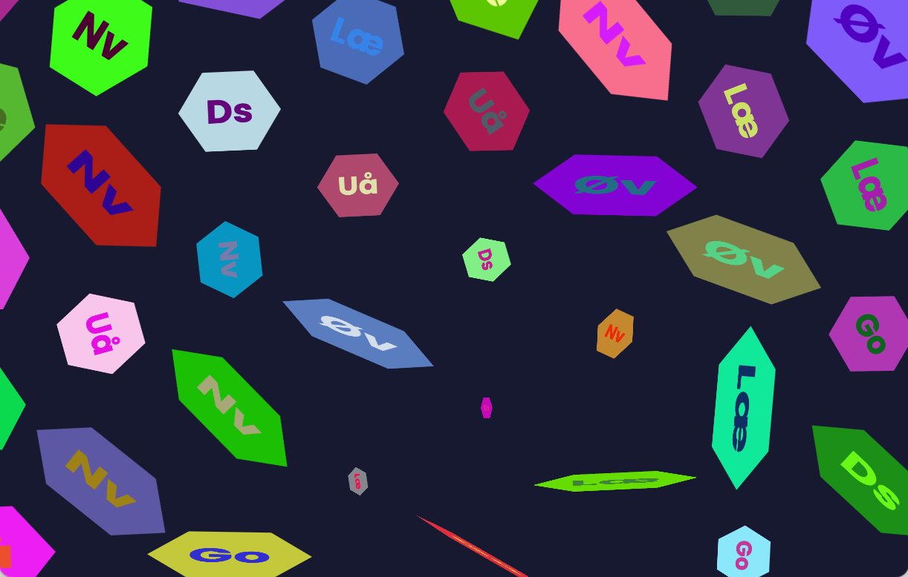

# Hexagons

Fill your browser with a grid of hexagons, and watch them gracefully transform in
many strangely-captivating ways.



## Deployment

Pushing to `main` (via a pull request) triggers a deployment to https://blaahaj.github.io/hexagons/

## Usage

Load the above page.

Maybe use your browser's zoom function / resize the window, and then refresh, until you're happy with the size and number of hexagons.

Sit back and watch.

Also, you can press:

- **f** to toggle **full-screen**
- **s** to **stop** the animation
- **g** to **go** again
- **n** to step to the **next** transition (only when stopped)

## Development

```shell
pnpm install
pnpm build
pnpm run
```
